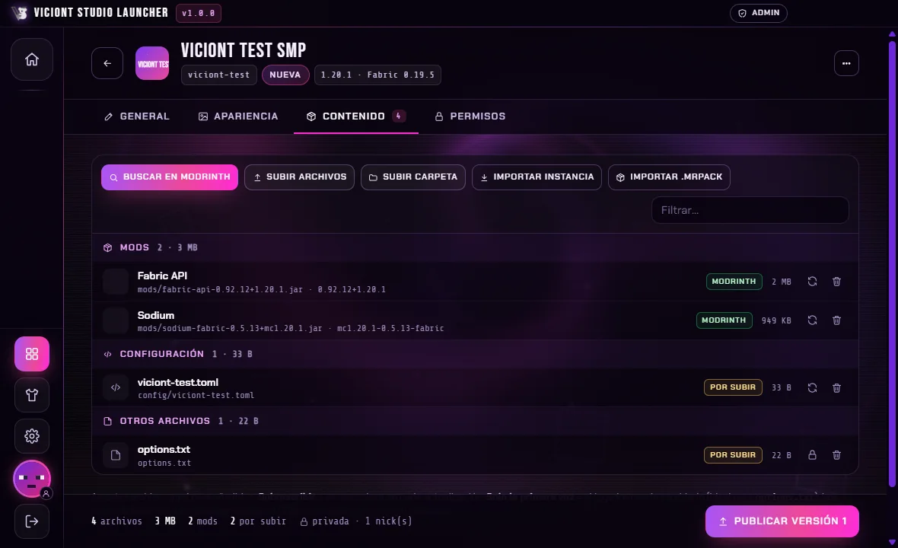
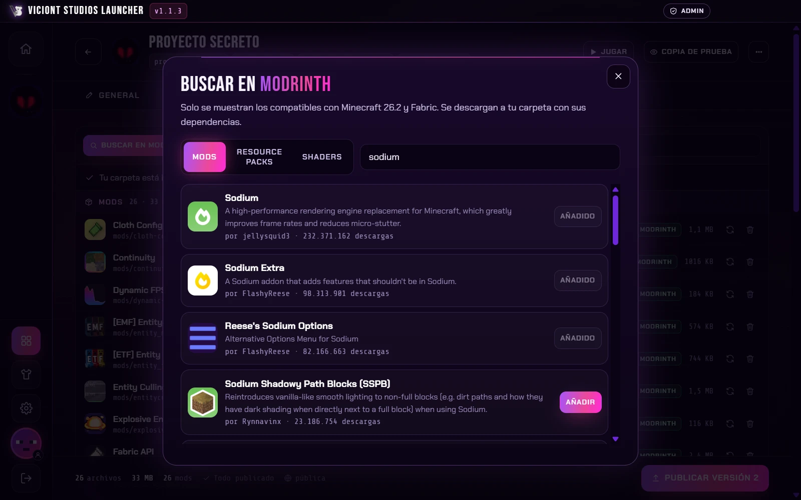

<p align="center">
  
</p>

<h1 align="center">Viciont Studio Launcher</h1>

<p align="center">
  El launcher de Minecraft oficial de <b>Viciont Studios</b>, creado por <b>CrissyjuanxD</b>.<br>
  Instancias públicas y privadas, cuentas premium y no premium, skins, y descargas rápidas y seguras.
</p>

<p align="center">
  <a href="https://github.com/CrissyjuanxD/Viciont-Studio-Launcher/releases/latest"><b>⬇ Descargar para Windows</b></a>
  ·
  <a href="https://crissyjuanxd.github.io/Viciont-Studios-Portafolio/">Web del estudio</a>
</p>

---

## Descargar

1. Entra en **[Releases](https://github.com/CrissyjuanxD/Viciont-Studio-Launcher/releases/latest)** y descarga `Viciont-Studio-Launcher-Setup-X.Y.Z.exe`.
2. Si el navegador avisa de que el archivo *"no se descarga habitualmente"*, no es un virus: el instalador es nuevo y no está firmado con un certificado de pago, así que Microsoft todavía no lo conoce.
   - **Edge:** en Descargas, pulsa la flecha **⌄** junto a *Eliminar* → **Conservar** → **Mostrar más** → **Conservar de todas formas**.
   - **Chrome:** en Descargas, pulsa **Conservar** (o *Descargar archivo no seguro*).
3. Ábrelo. Si Windows muestra *"Windows protegió tu PC"*, pulsa **Más información → Ejecutar de todas formas**.
4. Elige dónde instalarlo y listo. El launcher se **actualiza solo**: cada versión nueva cambia su nombre, por ejemplo *Viciont Studio Launcher 1.0.1*.

Requisitos: Windows 10 u 11 de 64 bits. No necesitas tener Java instalado: el launcher descarga el Java oficial que necesita cada versión de Minecraft.

## Capturas

| | |
|---|---|
|  |  |
|  |  |
|  |  |
|  |  |

## Qué hace

**Para los jugadores**
- **Iniciar sesión** con una cuenta de Microsoft (premium) o solo con un nick (no premium). Con Microsoft funciona igual que Modrinth App y el launcher oficial: la contraseña se escribe **solo en la página oficial de Microsoft** y el launcher nunca la ve. No deja usar un nick de una cuenta premium: lo comprueba en la misma base de datos de Mojang que usa NameMC.
- Cada nick no premium queda **reservado** con un código de recuperación, para que nadie se haga pasar por otro.
- **Skins** para las dos cuentas, con visor 3D, biblioteca y "copiar skin de un nick", como en Modrinth:
  - Premium: la skin y la capa se cambian en tu cuenta de Minecraft y se ven en todas partes.
  - No premium: la skin se guarda en el servidor del estudio y la ven quienes juegan con este launcher, gracias a CustomSkinLoader, que se añade solo a las instancias con mods. Quien use otro launcher te verá con la skin por defecto.
- **Barra lateral** con las instancias que tienes permiso para ver, la casita para volver al inicio, las skins, los ajustes, tu cabeza de la skin (al pasar el cursor dice qué cuenta tienes) y el botón de cerrar sesión.
- **Un solo botón** que cambia según el estado: **Descargar → Actualizar → Jugar → Jugando**. Mientras descarga se convierte en una tarjeta con la imagen de la instancia, el progreso, los MB/s y el tiempo que queda.
- Cada instancia tiene su **fondo propio**: imagen, GIF o vídeo.
- **Descargas rápidas**: varias a la vez, más conexiones para los archivos pequeños y desde los CDN oficiales (Mojang, Modrinth, Forge, NeoForge, Fabric y Quilt, más Cloudflare para los archivos del estudio).
- **Sin archivos dañados**: todo se descarga a un archivo temporal, se comprueba con SHA-1 y solo entonces se coloca en su sitio. Si cierras el launcher o se va la luz a mitad, la próxima vez se verifica y **continúa donde se quedó**. Al cerrar durante una descarga te pregunta y la pausa de forma segura.
- **Ajustes** de RAM (con la memoria de tu PC), argumentos de Java, resolución, pantalla completa, Java propio por versión, descargas simultáneas, efectos visuales, carpeta de datos (se puede mover) y qué hacer al abrir el juego.
- **Opciones por instancia**: RAM, Java, resolución y entrar directo al servidor.

**Para el estudio (administración en dos pasos: nick autorizado desde el panel web + clave personal)**
- Solo los nicks a los que se les da acceso desde el **panel web privado** ven **Ajustes → Administración**, y además tienen que escribir su **clave personal**. Cada uno tiene sus permisos: crear instancias, editar y publicar, eliminar, nicks no premium (y se puede limitar a algunas instancias).
- Crear instancias **Vanilla, Fabric, Quilt, Forge o NeoForge** en cualquier versión de Minecraft, snapshots incluidas.
- Añadir **mods, resource packs y shaders de Modrinth**, con sus dependencias añadidas solas, o **archivos propios**: mods, `config`, `options.txt`, `kubejs`, mapas, etc.
- **Importar** un modpack `.mrpack` o una carpeta de CurseForge, Prism, Modrinth App o `.minecraft`. Detecta la versión y el cargador, y reconoce los mods que existen en Modrinth para no subirlos.
- **Icono y fondo** (PNG, JPG, WEBP, GIF o vídeo MP4/WEBM). Las imágenes se optimizan solas.
- Instancias **públicas** o **privadas** (solo para los nicks que elijas).
- **Publicar versiones**: solo se suben los archivos nuevos o cambiados. Los jugadores ven **Actualizar** y el texto de novedades.
- Decidir qué archivos se sobrescriben en cada actualización y cuáles solo la primera vez, como `options.txt`, para no borrar los ajustes del jugador.
- Gestionar los nicks no premium registrados, por ejemplo liberar el de alguien que perdió su código.
- **Panel web** para el equipo de confianza (usuario, contraseña y verificación en dos pasos): permisos por nick y **registros** de todo lo que pasa (quién entra, quién está jugando, cambios de skin, descargas, actualizaciones y errores con el final del registro del juego) para ayudar a los jugadores cuando algo falla.

**Optimizado**
- El fondo animado (espiral, figuras flotantes, partículas y glitch) se dibuja a media resolución y con límite de FPS. Se **detiene por completo** cuando la ventana está minimizada, tapada o en segundo plano.
- Con la opción **"Cerrar la ventana"** al jugar, el launcher libera casi toda su memoria mientras juegas, se queda en la bandeja y vuelve a abrirse al cerrar el juego.

## Carpetas (como Modrinth App)

```
%APPDATA%\ViciontStudioLauncher\
├─ settings.json · accounts.dat (cifrado) · launcher_logs\
├─ meta\          ← compartido entre instancias
│  ├─ versions\  libraries\  assets\  natives\  java\
├─ instances\
│  └─ <instancia>\   mods · config · saves · resourcepacks · shaderpacks · …
├─ skins\  ·  caches\  ·  admin\  ·  backups\
```

La carpeta de datos se puede mover desde **Ajustes → Almacenamiento**.

## Desinstalar

Desde **Configuración de Windows → Aplicaciones → Viciont Studio Launcher**. El desinstalador pregunta:

- **Conservar** instancias, mundos, cuentas y skins, si vas a reinstalar.
- **Borrarlo todo**: instancias, mundos, cuentas, skins, Java y caché.

Las actualizaciones automáticas nunca borran datos.

## Servidor del estudio (Cloudflare Workers + R2 + D1)

Las instancias, los permisos, los archivos privados, las skins no premium, los registros y los administradores viven en un servidor gratuito de Cloudflare. La guía paso a paso está en **[server/README.md](server/README.md)**. Cuando lo tengas, pon su dirección en [`remote/launcher.json`](remote/launcher.json) y todos los launchers la usarán solos.

## Seguridad

- **Tu contraseña de Microsoft** solo se escribe en la página oficial de Microsoft, en una ventana aparte que solo puede abrir páginas de Microsoft (como Modrinth App). El launcher nunca la ve ni la guarda. Al cerrar sesión, Microsoft también olvida la cuenta en esa ventana.
- Las sesiones se guardan **cifradas con Windows (DPAPI)** en tu PC. Las cuentas premium se verifican con Mojang sin enviar su token al servidor del estudio.
- La interfaz no tiene acceso a Node ni a tus archivos (Electron con `contextIsolation`, `sandbox` y CSP estricta). La versión instalada lleva los "fusibles" de seguridad de Electron activados: no se puede arrancar como Node, ni con depuradores, ni cargar código que no sea el suyo.
- **Sin servidores falsos**: en la versión instalada el servidor del estudio sale siempre de la configuración oficial de este repositorio y no se puede cambiar a mano, así que nadie puede engañarte para conectarte a otro con mods maliciosos.
- La administración necesita **dos llaves** (nick autorizado desde el panel + clave personal vinculada a su cuenta) y el servidor comprueba los permisos en cada acción.
- Todo lo que se descarga se comprueba con **SHA-1**. Rutas peligrosas (`../`), la carpeta interna del launcher, enlaces sin HTTPS, archivos alterados y enlaces caducados se rechazan tanto en el launcher como en el servidor.
- Java solo se puede elegir entre ejecutables `java.exe`/`javaw.exe` reales, y al subir archivos al servidor solo se aceptan los que eliges tú en el diálogo o arrastras a la ventana.

### Privacidad

Para poder ayudarte si algo falla, el launcher envía al servidor del estudio un **registro de actividad** básico: cuándo abres el launcher, entras o sales, cambios de skin, descargas y actualizaciones, cuándo juegas y los errores (con tu nick, la versión del launcher, tu versión de Windows y tu RAM). **Nunca** se envían contraseñas, tokens, códigos de recuperación, tus archivos ni tu IP, y las rutas de tu PC se acortan (`C:\Users\tu-usuario` → `~`). Solo lo ve el equipo del estudio en su panel privado y se borra a los 30 días. Está explicado también en **Ajustes → Acerca de**.

## Desarrollo

```bash
npm install
npm run vendor   # copia fuentes y el visor 3D de skins a src/renderer
npm start        # abre el launcher (desde el código es siempre modo desarrollo)
npm run dist     # crea el instalador en dist/
```

Para publicar una versión nueva: sube el número de `version` en `package.json` y crea una etiqueta `vX.Y.Z`. GitHub Actions compila el instalador y lo publica en Releases, y los launchers instalados se actualizan solos.

## Créditos

Creado por **CrissyjuanxD** para **Viciont Studios**. El funcionamiento está inspirado en [Modrinth App](https://github.com/modrinth/code), que es de código abierto.

Usa [CustomSkinLoader](https://github.com/xfl03/MCCustomSkinLoader) (GPL-3.0, se descarga desde Modrinth), [skinview3d](https://github.com/bs-community/skinview3d) (MIT), la API pública de [Modrinth](https://docs.modrinth.com/), Electron (MIT) y las fuentes Bebas Neue, Chakra Petch y Share Tech Mono (SIL OFL 1.1).

Minecraft es una marca de Mojang Studios y Microsoft. Este proyecto no está afiliado a Mojang ni a Microsoft.
